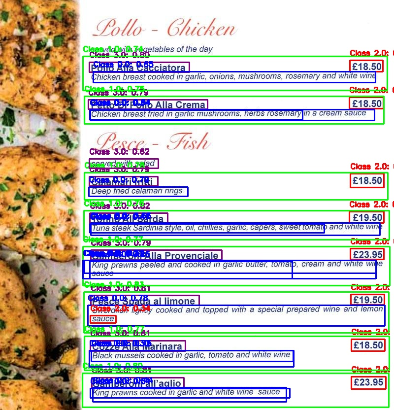

# OCR para Cartas de Restaurantes

## Introducción
Este proyecto tiene como objetivo facilitar la digitalización de cartas de restaurantes mediante el uso de reconocimiento óptico de caracteres (OCR). Utilizando un modelo de detección y segmentación basado en YOLOv8, el programa identifica secciones individuales en la carta, tales como nombres de platos, descripciones y precios. Una vez segmentado, el texto extraído es procesado y exportado en un formato estructurado a un archivo de texto (.txt), lo cual permite su fácil manipulación y almacenamiento.

## Fine-Tuning de YOLOv8

Para adaptar YOLOv8 a la detección y segmentación de componentes específicos en cartas de restaurantes, se ha realizado un ajuste fino (fine-tuning) del modelo utilizando un conjunto de datos personalizado. Este dataset incluye imágenes de menús de diferentes idiomas, tamaños y disposiciones, proporcionando una mayor versatilidad y precisión en la detección. Las etiquetas para la segmentación incluyen:

- `0` - Descripción del plato: detalla los ingredientes o características. <span style="display: inline-block; width: 12px; height: 12px; background-color: #FF0000; margin-left: 5px;"></span>
- `1` - Área de todos los componentes del plato: incluye todas las secciones visibles del plato. <span style="display: inline-block; width: 12px; height: 12px; background-color: #00FF00; margin-left: 5px;"></span>
- `2` - Precio del plato: permite extraer el costo asociado. <span style="display: inline-block; width: 12px; height: 12px; background-color: #0000FF; margin-left: 5px;"></span>
- `3` - Título del plato: contiene el nombre o título principal del plato. <span style="display: inline-block; width: 12px; height: 12px; background-color: #FFFF00; margin-left: 5px;"></span>

Estas etiquetas facilitan una detección precisa y organizada de los elementos más relevantes en una carta de restaurante.

### Aumentación de Datos con Albumentations

Para mejorar la robustez del modelo y su capacidad de generalización, se ha aplicado un conjunto de transformaciones de datos usando la librería **Albumentations**. Estas transformaciones incluyen:

- Conversión a escala de grises.
- Inversión horizontal aleatoria.
- Ajuste de brillo y contraste aleatorio.
- Desplazamiento, escalado y rotación para diferentes perspectivas.
- Aplicación de desenfoque leve para simular distintos niveles de calidad de imagen.

Estas aumentaciones ayudan al modelo a manejar variaciones en las cartas, como diferentes resoluciones, iluminaciones y orientaciones, logrando así un mejor rendimiento en situaciones reales.


<p align="center">
  
  &nbsp;&nbsp;&nbsp;&nbsp;&nbsp; <!-- Ajusta la cantidad de espacios para simular el margen -->
  
</p>

## Asignación de Componentes a Cada Elemento del Menú

Este proyecto utiliza un modelo YOLOv8 entrenado específicamente para segmentar y clasificar elementos en cartas de restaurantes. La segmentación incluye identificar áreas de cada plato en la carta, sus títulos, descripciones y precios. La siguiente fase del procesamiento organiza estos componentes, asignándolos a cada elemento del menú detectado.

### Extracción de Bounding Boxes
El modelo YOLOv8, entrenado en cartas de menú, permite extraer *bounding boxes* que rodean cada componente identificado en la imagen. Para cada imagen procesada:

1. Se obtienen las coordenadas de cada *bounding box* junto con su clase y confianza.
2. Si se habilita, el programa también dibuja estas cajas en la imagen, creando una visualización útil para verificar la precisión del modelo.

### Organización de Componentes por Elemento de Menú
Cada elemento principal del menú (área completa de un plato) se analiza para detectar componentes secundarios que le pertenezcan, como el título, descripción y precio. Para ello:

1. El modelo clasifica los bounding boxes en categorías de `título`, `descripción` y `precio` según sus etiquetas.
2. Utilizando una función de contención, se verifica si estos componentes secundarios están completamente contenidos dentro del área de cada elemento del menú.
3. Finalmente, se organiza la información en un diccionario que asocia cada elemento del menú con sus componentes correspondientes.

### Procesamiento de Datos Después del Modelo de Fine-Tuning

Una vez segmentados los componentes en la carta del restaurante, se realiza un procesamiento de datos adicional para extraer y organizar la información de manera estructurada.

1. **Filtrado de Elementos con Precio**: Solo se conservan los elementos que contienen una sección de `precio`, asegurando que cada elemento en el resultado tenga información de costo.

2. **Ordenación de Elementos por Posición**: Los elementos detectados se ordenan de izquierda a derecha y de arriba a abajo en la carta, siguiendo criterios de `x1` (posición izquierda) y `y1` (posición superior). Esto permite presentar la información en un orden natural, similar al formato visual del menú.

3. **Extracción de Texto con OCR**: 
   - Para cada componente (`title`, `description` y `price`), se extrae el área correspondiente en la imagen.
   - Cada imagen de componente es procesada para aumentar su resolución antes de aplicar OCR, mejorando la precisión del reconocimiento.
   - Con el uso de **PaddleOCR** en español, se extrae el texto de cada componente, que luego se almacena en un archivo de texto estructurado, facilitando la manipulación y exportación de la información del menú.

4. **Aumento de Resolución**: Para mejorar la precisión del OCR, cada componente es convertido a escala de grises y ampliado usando interpolación cúbica, lo que facilita la lectura del texto en imágenes de baja calidad o con resoluciones variables.

Este proceso asegura que la información extraída esté organizada y lista para aplicaciones que requieren datos estructurados de cartas de restaurantes.
### Uso del Programa

Para procesar una imagen de una carta de restaurante y extraer el texto estructurado, sigue estos pasos. Asegúrate de que el archivo `main.py` y todos los archivos de soporte estén correctamente ubicados.

1. Coloca la imagen de la carta de restaurante en el directorio designado, en este ejemplo `./real_menu_card_images/`.
2. Corre el script `main.py`, que contiene la función principal `process_menu_image` para procesar la imagen.

#### Ejemplo de Ejecución

```python
from image_to_text.image_to_text import process_menu_image

# Define las rutas de la imagen de entrada, imagen con bounding boxes y archivo de salida de texto
test_image_path = "./real_menu_card_images/carta2.jpg"
output_image_path = "output_with_bboxes.jpg"
output_txt_path = "menu_text_output.txt"

# Ejecuta el procesamiento
process_menu_image(test_image_path, output_image_path, output_txt_path)


